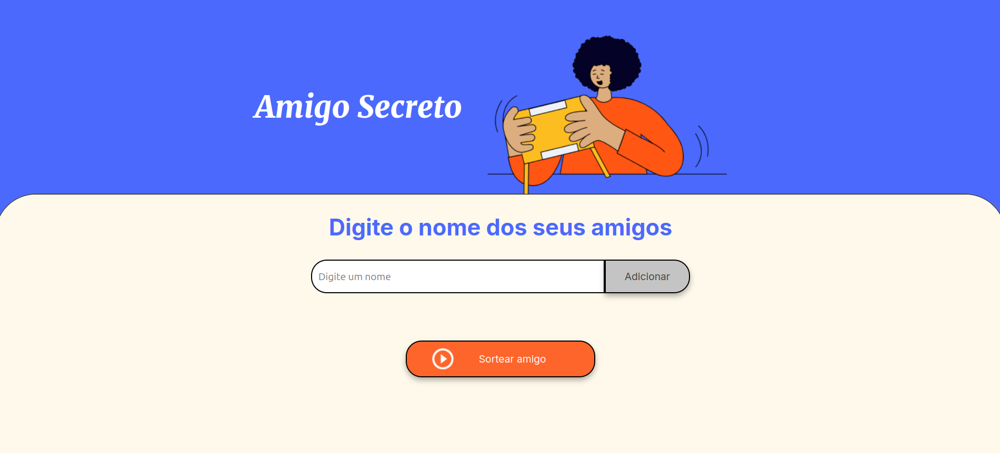
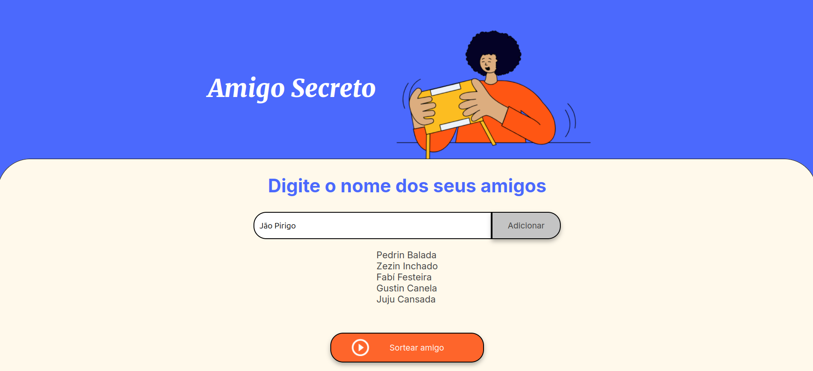
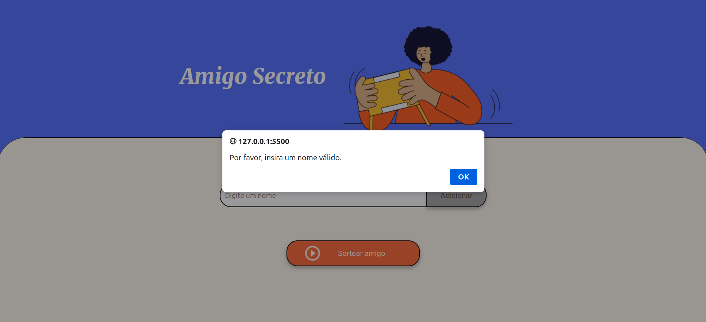
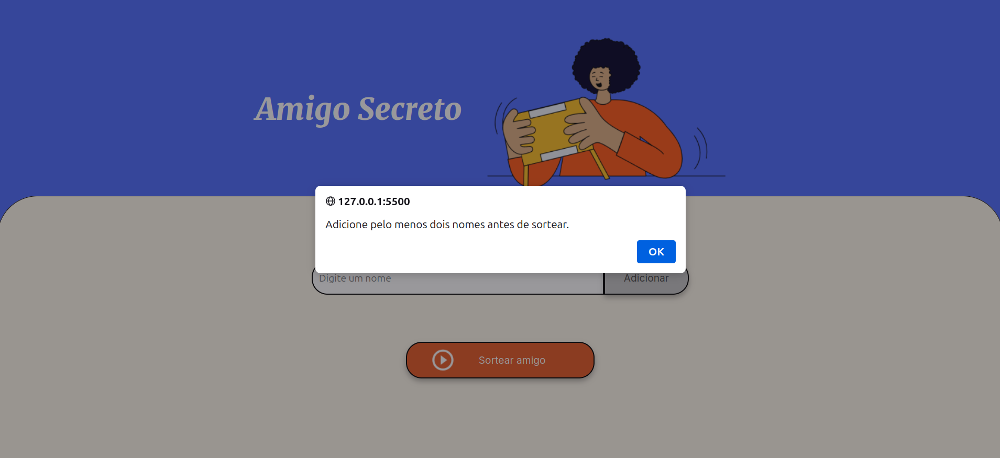
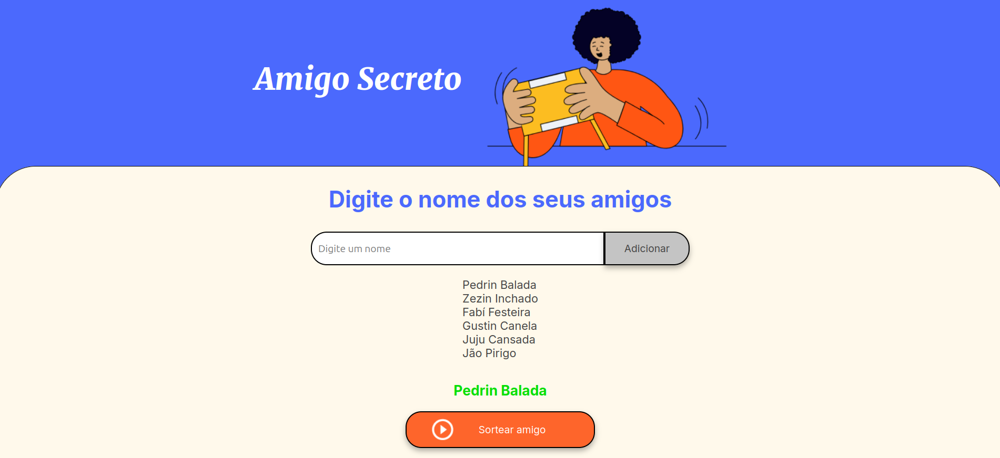

# 🎉 Challenge Amigo Secreto

## 📌 Descrição do Projeto

O desafio **Amigo Secreto** é um projeto que faz parte da formação do programa ONE, uma parceria entre **Alura + Oracle**. O objetivo principal é colocar em prática conceitos fundamentais de lógica de programação, como **variáveis, condicionais, funções, listas e loops de repetição**, por meio do desenvolvimento da lógica do código em **JavaScript** para o funcionamento da aplicação. A equipe da **Alura/Oracle** forneceu o **HTML e CSS**.

## 🚀 Funcionalidades

- ✅ Adicionar nomes dos amigos para realizar um sorteio aleatório.
- ✅ Exibir a lista de amigos adicionados.
- ✅ Sortear um nome da lista e exibir o resultado.
- ✅ Impedir sorteios com menos de dois participantes.
- ✅ Exibir alertas para erros ou informações importantes, como tentativas de sorteio inválidas e preenchimento obrigatório de campos.

## 🖥️ Demonstração

Aqui estão algumas imagens da aplicação funcionando:











## 🛠️ Tecnologias Utilizadas

- **HTML5**
- **CSS3**
- **JavaScript (ES6+)**

## 📂 Estrutura do Projeto

```
📂 ChallengeAmigoSecreto
├── 📁 assets             # Imagens e ícones
├── 📄 index.html         # Estrutura HTML
├── 📄 style.css          # Estilos da aplicação
├── 📄 app.js             # Lógica em JavaScript
└── 📄 README.md          # Documentação do projeto
```

## 🔧 Como Executar o Projeto

1. Clone este repositório:
   ```bash
   git clone https://github.com/Ricardo-Ottoni/ChallengeAmigoSecreto.git
   ```
2. Acesse a pasta do projeto:
   ```bash
   cd ChallengeAmigoSecreto
   ```
3. Abra o arquivo `index.html` no navegador.

## 📝 Créditos

- **HTML e CSS**: fornecidos pela equipe **Alura/Oracle** no programa ONE G8.
- **JavaScript**: desenvolvido por [Ricardo Ottoni](https://github.com/Ricardo-Ottoni).

